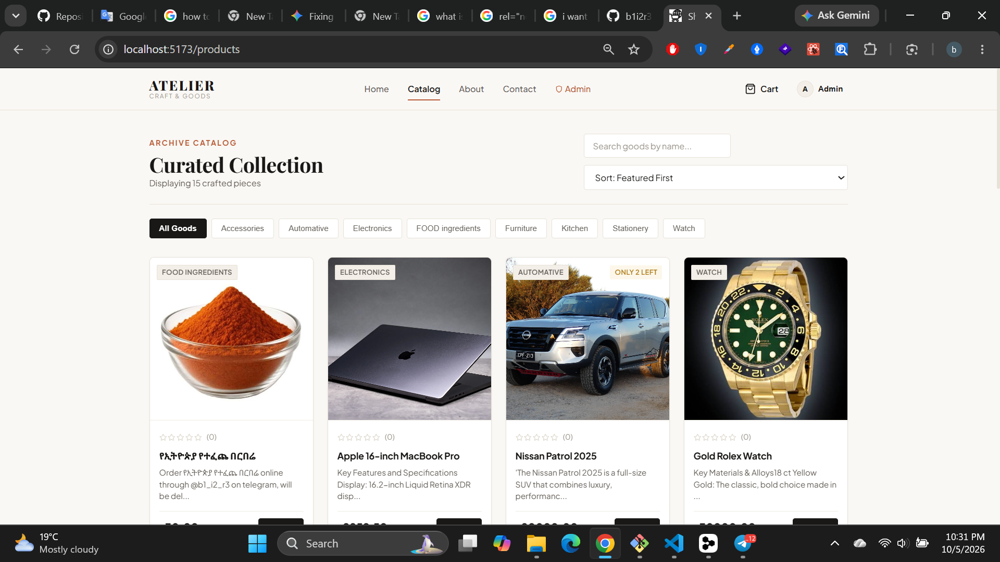

# ShopWave

A full-stack(MERN) e-commerce web application for browsing and buying items, with a separate admin area for managing products and orders.

Built with **React (Vite)** on the front end and **Node.js, Express and MongoDB** on the back end.



## Features

- Browse products with images and star ratings
- User accounts with token-based authentication
- Protected admin pages for managing orders and products
- Product image uploads
- Seed script that fills the database with starter data
- Responsive layout

> Edit this list so it matches exactly what your app does.

---

## Tech Stack

| Part      | Technology                                   |
| --------- | -------------------------------------------- |
| Frontend  | React, Vite, React Router, Axios, Context API |
| Backend   | Node.js, Express                             |
| Database  | MongoDB with Mongoose                        |
| Auth      | JSON Web Tokens (JWT)                        |

---

## Project Structure

```
ecommerce/
├── backend/
│   ├── config/        # Database connection and app settings
│   ├── controllers/   # Logic that handles each request
│   ├── middleware/    # Authentication and request guards
│   ├── models/        # Mongoose schemas
│   ├── routes/        # API endpoints
│   ├── seed/          # Starter data
│   └── utils/         # Helper functions
├── frontend/
│   ├── public/        # Static assets
│   └── src/
│       ├── api/         # Axios setup and API calls
│       ├── components/  # Reusable UI pieces (layout, product, ui)
│       ├── context/     # Shared app state
│       ├── hooks/       # Custom React hooks
│       ├── pages/       # Full screens
│       ├── router/      # Routes and navigation
│       └── utils/       # Helper functions
├── uploads/           # Product images
├── server.js          # Express server entry point
└── package.json
```

---

## Getting Started

### Prerequisites

- [Node.js](https://nodejs.org/) (v18 or newer)
- [MongoDB](https://www.mongodb.com/) (a local install or a free MongoDB Atlas cluster)
- [Git](https://git-scm.com/)

### 1. Clone the repository

```bash
git clone https://github.com/b1i2r3bura/ecommerce.git
cd ecommerce
```

### 2. Set up the backend

```bash
npm install
```

Create your own environment file by copying the template:

```bash
cp .env.example .env
```

Open `.env` and fill in your real values (see [Environment Variables](#environment-variables)). **Never commit this file.**

### 3. Seed the database (optional)

```bash
# replace with your actual seed command
node backend/seed/seed.js
```

### 4. Start the backend

```bash
# replace with your actual start script
npm run dev
```

### 5. Set up and start the frontend

Open a second terminal:

```bash
cd frontend
npm install
npm run dev
```

The app will be available at `http://localhost:5173`.

---

## Environment Variables

Copy `.env.example` to `.env` and set:

| Variable     | Description                          |
| ------------ | ------------------------------------ |
| `MONGO_URI`  | Your MongoDB connection string       |
| `PORT`       | Port the backend runs on (e.g. 5000) |
| `JWT_SECRET` | A long, random secret for signing tokens |

> Match this table to the names inside your own `.env.example`.

---

## Security Notes

- Secrets live in `.env`, which is excluded from Git through `.gitignore`.
- Only `.env.example` (with placeholder values) is published.
- Do not share your real connection string or JWT secret.

---

## Roadmap

- [ ] Payment integration
- [ ] Order email notifications
- [ ] Automated tests
- [ ] Deployment

---

## Author

**Biruk Mitku**
GitHub: https://github.com/b1i2r3bura

---

